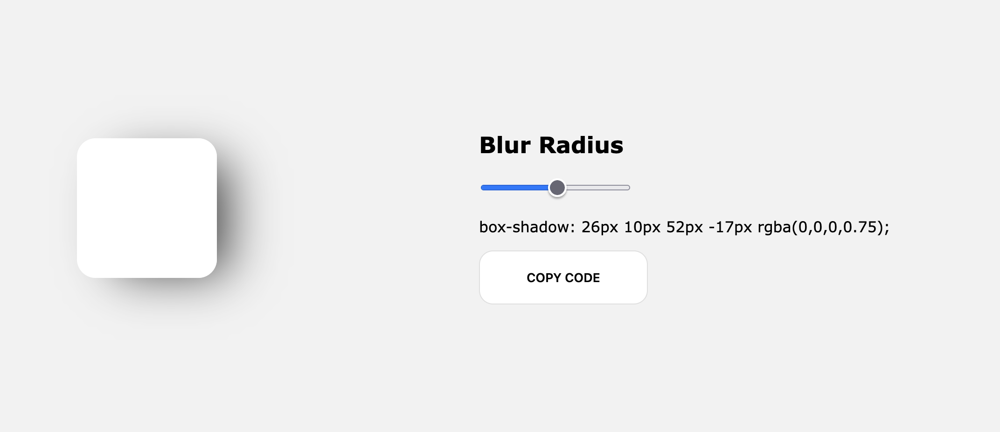

Are you tired of not being able to create the perfect shadow settings while coding some site and you want to make your life a bit easier and fun by checking things in realtime and then copy the needed code? Well that project is fixing one of our problems we developers have! :)

