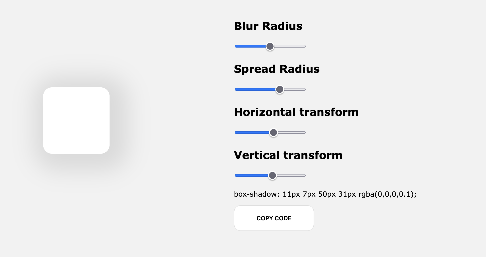

Are you tired of not being able to change settings on some element while coding some site and you want to make your life a bit easier and fun by checking things in realtime how they look and then copy the needed code? Well that is a thing for fixing small problem we developers have! :)

